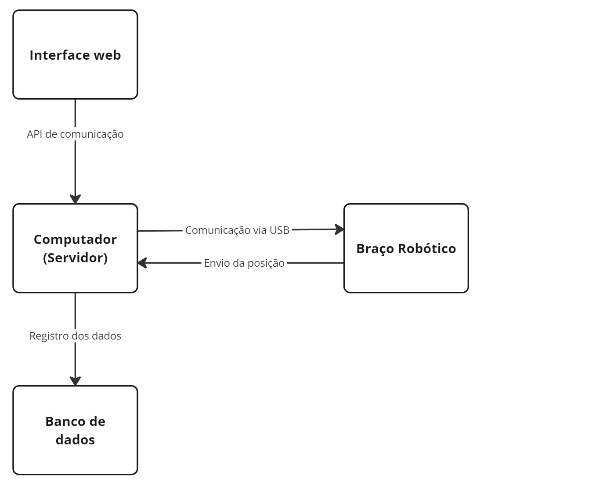

A seguir vamos apresentar o diagrama em blocos da solução que estamos desenvolvendo. Este modelo de diagrama é uma representação visual da arquitetura e dos principais componentes do nosso sistema de montagem automatizada de kits hospitalares. Ele fornece uma visão geral da estrutura do sistema e das interações entre seus diferentes elementos. Nesta documentação, vamos descrever cada bloco do diagrama e sua função dentro do contexto do projeto.

O principal componente da nossa solução é um braço robótico, responsável pela montagem automatizada dos kits hospitalares. Ele é equipado com ferramentas especializadas para manipular os diversos componentes dos kits, como garras e pistões sucção, e realizar as operações de montagem de forma precisa e segura.

Temos também a interface web que permite o controle e monitoramento do sistema de montagem. Ela oferece funcionalidades para iniciar, pausar e monitorar essas operações, além de fornecer feedback em tempo real sobre o status do sistema. Temos também um computador, que é o servidor que hospeda a interface web e fornece a infraestrutura necessária para a comunicação com o braço robótico e os sensores. A comunicação entre o computador e o braço robótico é feita por meio de conexão USB com o computador e possivelmente uma conexão remota, que permite a transmissão de comandos e dados entre os dois dispositivos.

A base de dados armazena informações sobre os diferentes tipos de kits hospitalares que podem ser montados pelo sistema. O banco vai incluir detalhes sobre os componentes dos kits, instruções de montagem e outras informações relevantes para o processo de montagem automatizada.

Como suporte para o entedimento da nossa solução, criamos um wireframe da interface que o usuário terá acesso, que pode ser acesso aqui [Wireframe da Interface do Usuário](../arquitetura-sistema/wireframeInteface.md).