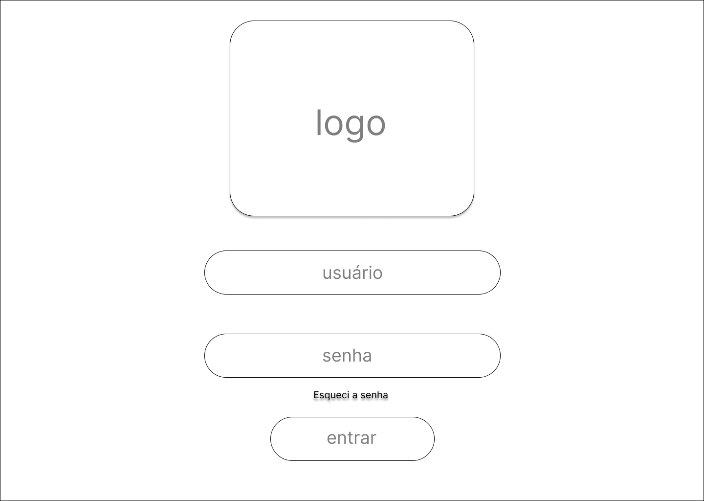
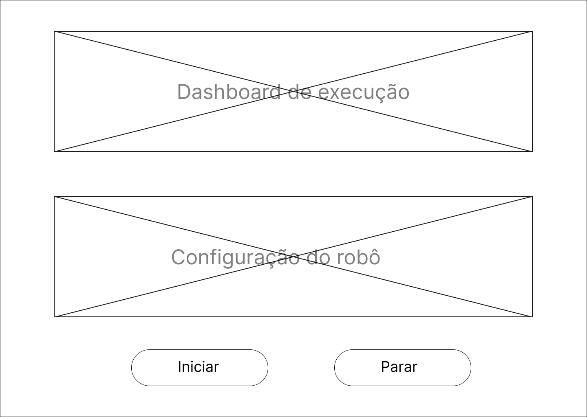
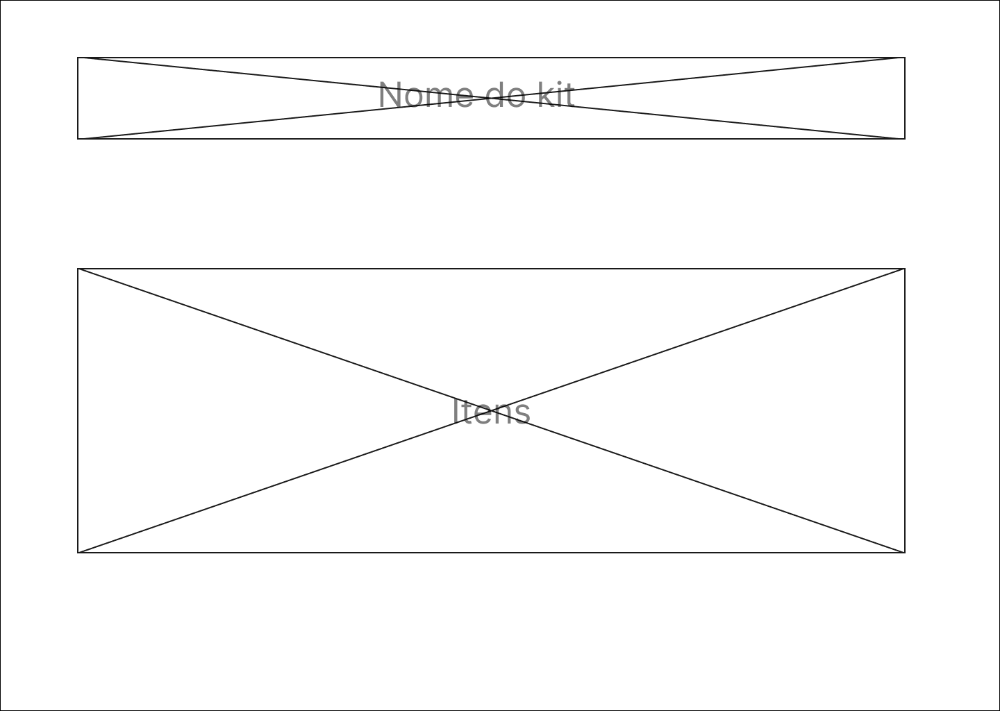

# Wireframe da Interface do Usuário

Para um melhor entedimento da experiência do usuário, foi elaborado um wireframe que representa a estrutura e o layout da interface do sistema de montagem automatizada de kits hospitalares. O wireframe é uma ferramenta visual que permite a representação esquemática da interface, sem a presença de cores, imagens ou estilos visuais, focando na disposição dos elementos e na organização das informações. Ele é utilizado para planejar e projetar a interface do usuário, permitindo a visualização e a validação das funcionalidades e do fluxo de navegação do sistema. Em relação ao nosso projeto, o wireframe foi desenvolvido para a interface web que será utilizada para controlar e monitorar as informações do sistema do braço robotico que estará montando os kits hospitalares. Mais detalhes sobre como a interface será utilizada e quais funcionalidades estarão disponíveis podem ser encontrados na seção de [requisitos funcionais](../arquitetura-sistema/requisitos.md) e no [diagrama de blocos da solução](../arquitetura-sistema/diagrama-blocos.md).

A seguir temos a **tela de login na plataforma**, onde o usuário poderá acessar o sistema. Ela é simples, sendo composta por um campo para inserir o e-mail e outro para a senha, além de um botão para realizar o login:

Aqui na **tela Inicial**, temos um dashboard onde o usuário poderá visualizar as informações do sistema, como o status do braço robótico, a quantidade de kits montados, a quantidade de medicamentos disponíveis, possíveis bugs e entre outras informações. Além disso, o usuário poderá acessar as configurações do sistema e realizar ações como iniciar e pausar a montagem dos kits:

Na **tela de configuração do KIT**, o usuário poderá configurar os kits que serão montados pelo braço robótico. Ele poderá selecionar os medicamentos e equipamentos hospitalares que farão parte do kit, a quantidade de cada medicamento e o local de armazenamento onde o medicamento está localizado:

É importe resaltar que o wireframe foi feito para dar suporte ao diagrama em blocos da solução, como sugestão do nosso orientador, e para nos ajudar a entender melhor como vai ser a solução final, então o wireframe vai sofrer alterações conforme o desenvolvimento do projeto.