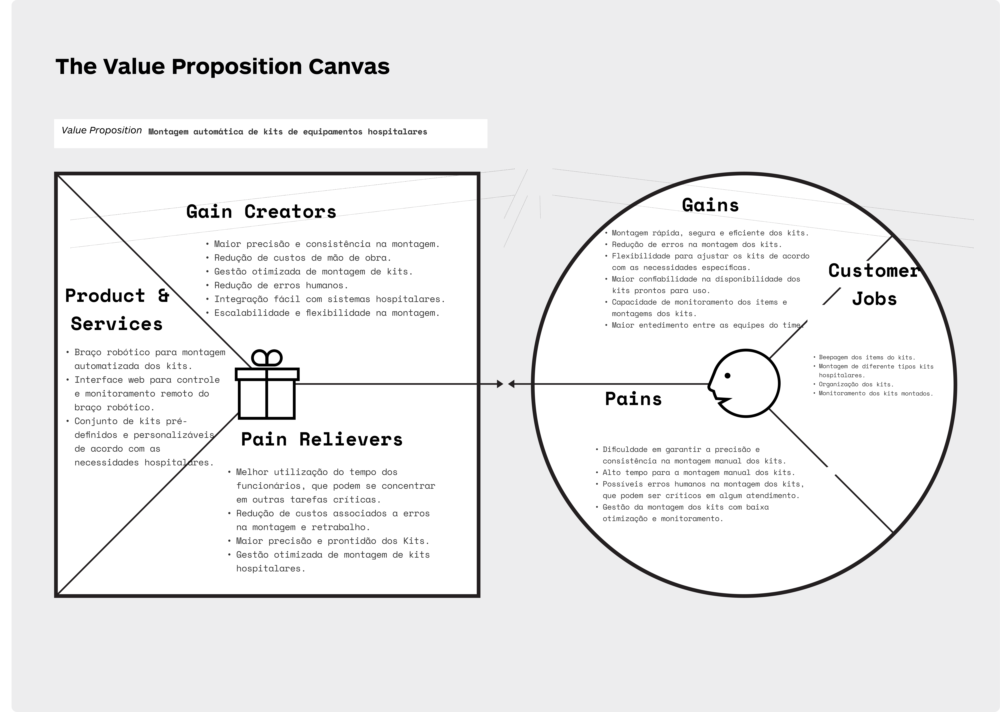

# Canvas Proposta de valor

Para demonstrar de maneira visual e prática os atributos do nosso projeto, utilizamos o Value Proposition Cavas ou Canvas Proposta de Valor (CPV). O CPV é uma ferramenta estratégica no mundo de negócios que é utilizada para compreender e explicar a proposta de valor de um produto ou serviço. Ele fornece uma estrutura visual para analisar e descrever como um produto ou serviço satisfaz as necessidades, dores e ganhos dos clientes. Especificamente nesse projeto, o VPC está sendo empregado como uma ferramenta entender melhor a proposta de valor do nosso sistema de montagem automatizada de kits hospitalares.

Imagem 1: Canvas Proposta de Valor

Fonte: Elaborado pela equipe Cardio-Bot

Na parte do perfil do cliente, vemos que a área de farmacia, responsável pela montagem dos kits hospitalares, têm uma necessidade crítica de realizar essa montagem de forma rápida, segura, precisa e eficiente para garantir a qualidade no tratamento dos pacientes. As principais dores enfrentadas pelos hospitais foram: A dificuldade em garantir precisão e consistência na montagem manual dos kits; O tempo gasto para a realização dessa atividade; O risco de erros humanos; E por fim, a dificuldade de gerir e monitorar a montagem desses kits, devido à troca de turnos de equipes no hospital. Além disso, reconhecemos que os hospitais se beneficiariam muito de alguns atributos, tais como: uma montagem rápida e eficiente dos kits, redução de erros, possibilidade de personalização em relação aos remédios inseridos e maior confiabilidade na disponibilidade dos mesmos.

Já na parte do valor da solução, desenvolvemos um sistema de montagem automatizada de kits hospitalares, equipado com um braço robótico e uma interface web de controle e monitoramento. O sistema oferece ganhos significativos para os hospitais, proporcionando precisão e consistência na montagem dos kits, reduzindo o tempo necessário para a montagem, eliminando erros humanos, permitindo controle remoto e customização flexível dos kits.