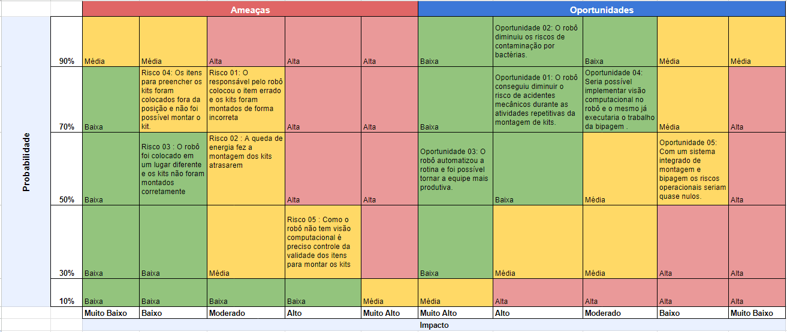

Após todo o processo de análise de mercado, entendimento das dores do cliente e definição do valor agregado da nossa solução, é muito importante mapeat quais são as ameaças potenciais que podem impactar o funcionamento correto das *features*, para que haja a mitigação da possibilidade de que situações adversas aconteçam, ou a construção de um plano de ação para situações de crise. É por essa razão que utilizamos a matriz de risco, pois é uma forma de visualizar de maneira rápida quais são os riscos e o nível de impacto que estes causam. Além disso, é possível mapear oportunidades que foram encontradas em relação ao projeto.

Na seção de riscos, é importante observar que os maiores desafios derivam de erros humanos, seja ao posicionar o robô em uma posição fora do padrão, selecionar os itens inadequados para a montagem, ou negligenciar a verificação da validade. Um ponto crucial a lembrar é que o projeto não inclui visão computacional; portanto, o posicionamento dos itens deve sempre seguir um padrão fixo para garantir o funcionamento correto do robô.

Quanto às oportunidades, o robô pode reduzir o trabalho manual repetitivo, diminuir os riscos de acidentes e contaminação. Além disso, há a perspectiva de implementar, no futuro, visão computacional e verificação individual de cada produto antes da montagem do kit. 

A figura abaixo demonstra os riscos e oportunidades que foram encontrados durante o desenvolvimento do projeto. 

 

Matriz 2: Matriz de Risco

Fonte: Elaborado pela equipe Cardio-Bot

