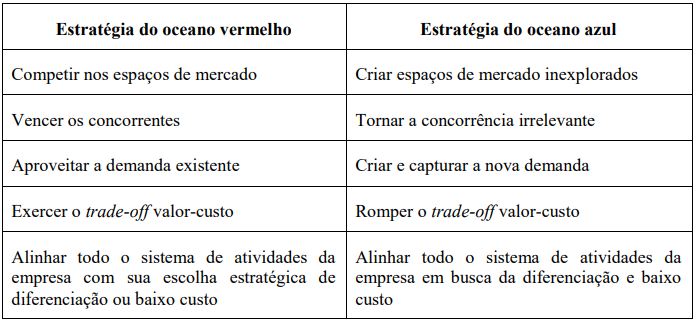

# Avaliação de mercado

Para compreender e mensurar o valor do projeto é necessário que haja uma avaliação do que já existe no mercado e quais são os diferenciais que a nossa proposta traz. A exemplo desse projeto, como estamos trabalhando em um recorte específico que é a farmácia hospitalar interna do Sírio Libanês, devemos analisar o processo atual e comparar com as diferenças que a implantação do nosso projeto traria.

Antes de tudo, é muito importante compreender o método de análise que está sendo utilizado, que é a Estratégia do Oceano Azul, difundida através da publicação “A Estratégia do Oceano Azul: Como criar novos mercados e tornar a concorrência irrelevante”, de Kim e Mauborgne (2005). Neste livro, discorre-se sobre uma maneira de visualizar o mercado dividido em duas partes: oceano vermelho e azul. 

O oceano vermelho representa mercados que já existem e são tomados por muitos concorrentes, simbolizando uma batalha sangrenta onde tudo que se busca é superar e se diferenciar  dos adversários. Já o oceano azul é um mercado que ainda não existe e/ou não foi explorado, onde as águas são calmas e não há concorrência, pois é algo completamente novo.

“(…) a Estratégia do Oceano Azul se apresenta como uma forma inovadora de pensar o planejamento estratégico dentro das empresas, tendo como pilar a inovação de valor que consiste em reduzir custos e ampliar o valor para o comprador.” (Oliveira, 2017, p. 2 ). Para uma melhor visualização dessa ideia, veja o quadro abaixo:

Quadro 1 - Estratégia do oceano vermelho *versus* estratégia do oceano azul

Fonte: Kim e Mauborgne (2005, p.37)

  

## Matriz de oceano azul

Para que consigamos criar nosso oceano azul, há alguns aspectos que precisamos analisar nos mercados já existentes (nesse caso, o processo existente dentro da farmácia hospitalar) e que podem ser modificados através da nossa solução. Algumas perguntas muito importantes nesse processo são:

- Quais características podem ser **reduzidas**  em relação aos padrões desse setor?
- Quais características que atualmente são consideradas indispensáveis podem ser **eliminadas**?
- Quais características nunca antes oferecidas pelo setor podem ser **criadas**?
- Quais características podem ser **elevadas** acima dos padrões atualmente encontrados?

E para facilitar a visualização da resposta dessas perguntas, separamos em uma matriz em quais aspectos nosso projeto pode reduzir, eliminar, criar e elevar.

Matriz 1 - Eliminar, Elevar, Reduzir e Criar

Fonte: Elaborado pela equipe Cardio-Bot

Para justificar as características apresentadas acima, fizemos uma análise entre o que o nosso projeto traria para a farmácia hospitalar do Sírio Libanês em comparação com o processo manual que é implementado atualmente, conforme a tabela abaixo (Tabela 1) que simboliza numericamente o nivel correspondente de cada sessão, variando de 0 a 10, sendo 0 o mínimo e 10 o máximo.

Tabela 1: Atributos do Projeto *versus* Processo Manual

| Atributos | Robô | Processo Manual |
| --- | --- | --- |
| Custo | 8 | 10 |
| Tempo Gasto | 4 | 10 |
| Precisão | 9 | 6 |
| Praticidade | 10 | 5 |
| Segurança | 8 | 5 |
| Qualidade do ambiente de trabalho | 10 | 6 |
| Desgaste físico dos colaboradores | 0 | 10 |

Fonte: Elaborado pela equipe Cardio-Bot

- **Custo:**  Atualmente, o processo manual conta com uma equipe de 92 pessoas apenas para a montagem dos kits médicos, sem contar os custos de possíveis erros de manuseio dos medicamentos. Com o processo sendo realizado por um robô, grande parte do custo com a mão de obra seria minimizado, pois a quantidade de trabalhadores designados para essa tarefa específica seria muito menor. Porém, o custo de implementação do robô é alto, gerando um alto gasto para a empresa que será recompensado a longo prazo.
- **Tempo gasto:**  O tempo necessário para a montagem dos kits também seria diminuído, pois o robô possui uma movimentação precisa e computadorizada, fazendo com que a separação dos medicamentos aconteça de forma muito mais rápida.
- **Precisão:** Atualmente o processo está suscetível ao erro humano, que seria erradicado através da automatização, pois o robô faria os movimentos programados com uma precisão muito elevada. Como os medicamentos estariam organizados em um layout fixo, também diminuiria o risco de alguém confundir duas ampolas muito parecidas.
- **Praticidade:** Ao invés de montar os kits um por um, apenas um colaborador seria responsável por organizar os medicamentos estocados em seus respectivos lugares, e todo o processo de montagem seria responsabilidade do robô, aumentando assim a praticidade.
- **Segurança:** Correlacionado ao ganho de precisão, a segurança também aumentaria, pois os erros seriam diminuídos, garantindo assim que os remédios certos chegariam aos pacientes certos.
- **Qualidade do ambiente de trabalho:** Como o processo repetitivo seria minimizado, a qualidade do ambiente de trabalho aumentaria, além das relações entre os trabalhadores também melhorarem, como será explicado no tópico a seguir.
- **Desgaste interpessoal dos colaboradores:** Foi mencionado na entrevista com  o parceiro que há alguns desentendimentos entre os colaboradores pois a montagem dos kits é maçante, fazendo com que os funcionários de um turno deixem a montagem para o turno seguinte, gerando desentendimentos. Como a maior parte da montagem seria realizada pelo robô, essas discussões seriam erradicadas.
- **Automatização:** Atualmente, o processo de automatização dentro desse nicho de montagem dos kits ainda não existe, e com a entrada do nosso projeto, esse aspecto seria criado, aumentando a tecnologia no setor.

## Referências

OLIVEIRA, R. D. de. **Análise Comparativa e Relacional entre a Estratégia do Oceano Azul e o Design Thinking para Gestão de Inovação.** 2017. 23f. Revista Brasileira de Gestão e Inovação – Brazilian Journal of Management & Innovation, 2018.

MAUBORGNE, R. W. e KIM, C. W. **A Estratégia do Oceano Azul.** 2005