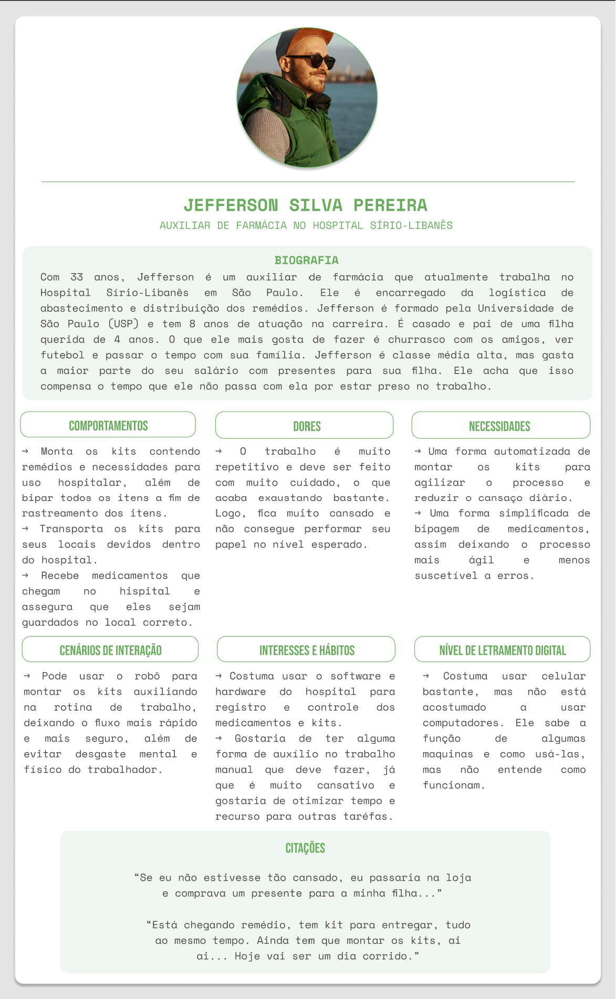
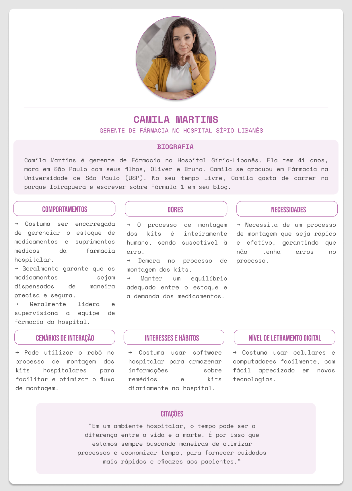

Na criação desta solução, foi necessário pensar na elaboração de personas, que são representações fictícias do público alvo de um produto ou serviço. Para o desenvolvimento das personas, foram feitas pesquisas sobre as principais pessoas afetadas. Com isso, foi estabelecido que as personas deverão representar tanto a gerência da farmácia hospitalar do Hospital Sírio-Libanês, como quem trabalha na farmácia. Assim, foram criadas duas personas, Jefferson (Figura 1), que representa o colaborador que atua na farmácia, e Camila (Figura 2), que representa a gerência da farmácia hospitalar.

**Figura 1:** Persona 1 - Jefferson

**Fonte:** Elaborado pela equipe Cardio Bot

 

**Figura 1:** Persona 2 - Camila

**Fonte:** Elaborado pela equipe Cardio Bot

 

Com a confecção das personas acima, foi indentificada a maior dor do cliente, a confecção dos kits. De acordo com isso, planejamos a nossa solução, um robô que irá auxiliar na montagem dos kits.