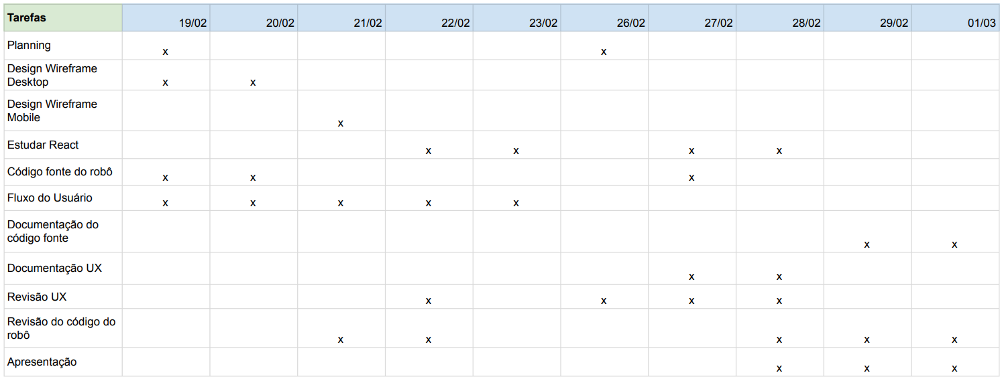

# Distribuição de atividades

Nessa segunda sprint, houve um aprofundamento maior no desenvolvimento do fluxo de utilização do nosso projeto, além de uma concepção um pouco mais estruturada das features da nossa interface e avanços no funcionamento do braço robótico (já podendo ser controlado e desempenhar a função de ordenação de itens por CLI). Para visualização de todas as tarefas e a duração de cada uma delas, é possível observar a tabela abaixo (tabela 1), que lista todas as tasks e em quais dias elas foram desenvolvidas respectivamente:

**Tabela 1** - Relatório da Sprint 2

**Fonte:** Elaborado pela equipe Cardio-Bot

A seguir temos o slide de aprensetação da sprint 2:

[Clique para acessar a apresentação](../../../static/img/ApresentacaoSprint2-Cardiobot.pdf)

