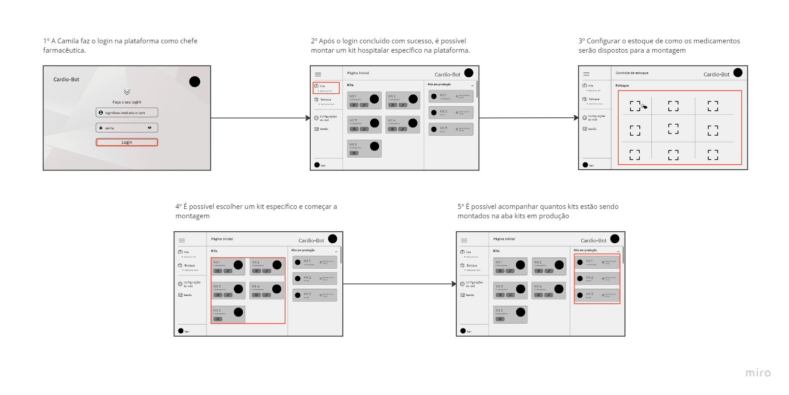
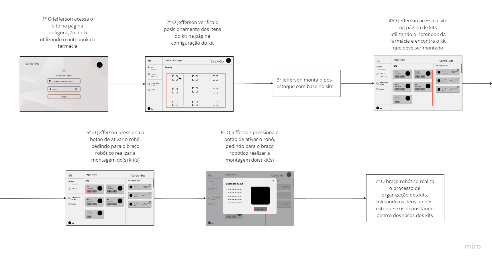

import ReactPlayer from 'react-player'
import MyVideoUrl from '../../../static/video/ExecucaoRoboBlocos.mp4';

# Mapeamento do Fluxo de Utilização da Solução

## Introdução

Nesta seção iremos descrever o fluxo de utilização da solução, que é uma representação visual das etapas e a sequência de ações que as personas realizarão ao utilizar a solução. O fluxo de utilização da solução é fundamental para entender como cada usuário irá interagir de forma prática com o software desenvolvido. Esse mapeamento será feito com base nas personas definidas na [seção de personas](../../Sprint%201/user_expirience/personas.md) e será utilizados as imagens do wireframe para ilustrar as interações que estão sendo feitas pelo usuário.

A compreensão do fluxo de utilização da solução é fundamental para entender como cada usuário irá interagir de forma prática com o software desenvolvido. Este fluxo delineia as etapas e a sequência de ações que as personas realizarão ao utilizar a solução. Ao compreender esse fluxo, é possível aprimorar a experiência do usuário, garantindo que o software atenda às necessidades específicas de cada perfil e otimize sua usabilidade.

## Fluxo de Utilização da Solução - Persona: Camila

O primeiro passo para utilizar a solução corretamente é fazer login como chefe farmacêutico. O chefe de farmácia possui permissão para configurar a disposição dos medicamentos na bandeja e modificar os kits.

Após o login bem-sucedido, é possível acessar o dashboard da solução. Nesta tela, é permitido montar ou alterar os kits, acompanhar os kits em produção e também ajustar o estoque, que consiste nos medicamentos utilizados para compor novos kits.

Uma das telas mais cruciais é a de configuração do estoque, onde se pode definir os itens que comporão os kits. A disposição dos itens é muito importante, já que o robô não possui visão computacional. Portanto, o layout do estoque deve ser consistente com a disposição dos items na bandeja, caso contrário, os kits serão montados incorretamente.

Voltando ao dashboard, é possível selecionar um kit específico e iniciar a sua produção. Além disso, também é possível acompanhar a montagem de outros kits e acompanhar o status dos mesmos. 

## Fluxo de Utilização da Solução - Persona: Jefferson

Para representar a ação 7 do fluxo de utilização da solução para a persona Jefferson, colocamos um vídeo demonstrativo de como seria a execução do robô montando os kits.

<ReactPlayer playing controls url={MyVideoUrl} />

