# Wireframes - maior fidelidade

## Introdução

Durante o processo de definição de como funcionaria o fluxo da solução, foi feito um [planejamento preliminar](../../Sprint%201/arquitetura-sistema/wireframeInteface.md) de quais telas gostaríamos em nossa aplicação web, que seria responsável por permitir que cliente configure e monitore as tarefas do robô. Nessa Sprint 2, foi contruído um wireframe com uma fidelidade um pouco maior, pois foi percebido que algumas funções que eram necessárias ainda não estavam sendo contempladas no esboço anterior. 

Um wireframe é uma representação visual de uma interface, utilizada nas fases iniciais de design, nesse caso, de uma aplicação web. São úteis para a validação das features que serão necessárias no projeto, além de gerar debates a fim de maximizar a satisfação do usuário final, pois o fluxo de utilização é fortemente considerado e planejado.

A seguir, é possível visualizar uma versão um pouco mais fiel e detalhada de um wireframe, com a adição de algumas telas que ainda não estavam presentes na versão anterior.

## Versão Desktop

Por ordem de prioridade, foi desenvolvido o wireframe da versão de desktop, que a princípio seria o principal modo de acesso ao site. Isso porque, nas reuniões com o parceiro, foi levantado que há a presença de notebooks para realizar as tarefas logísticas, e esse tipo de trabalho já é realizado por meio destes dispositivos, sendo raros os momentos de uso de um dispositivo mobile.

Para iniciar, começamos com a tela de login, que permite ou não que o usuário acesse o site e suas funcionalidades, como pode ser visto abaixo:

**Tela 1** - Login

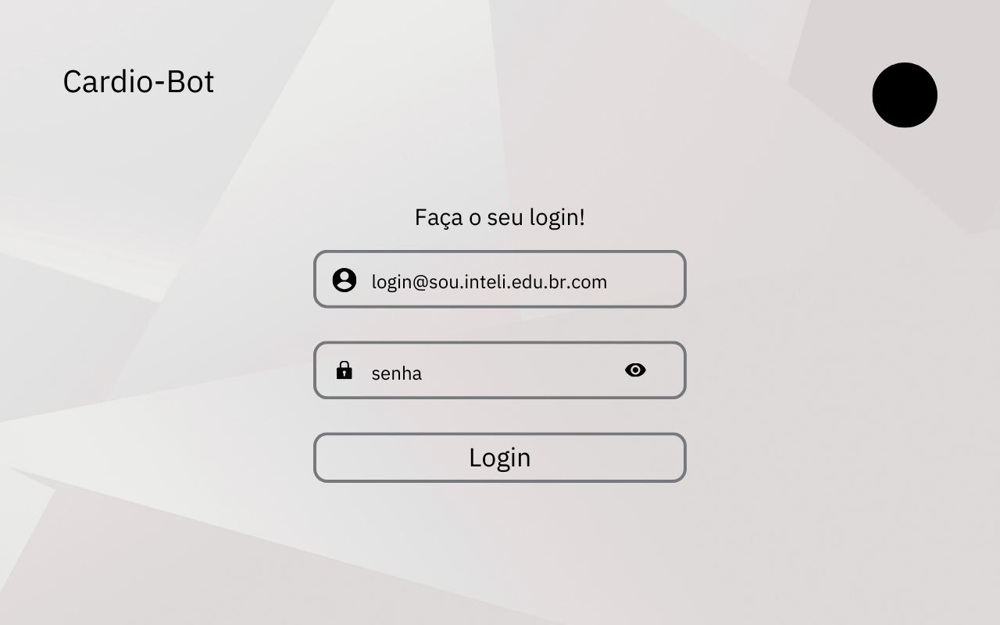

****Fonte:**** Elaborado pela equipe Cardio-Bot

Ao acessar o site com o usuário e senha corretos, o usuário se deparará com a tela principal (Tela 2), onde será possível ver os kits já configurados, acompanhar os que estão em produção e também acessar o menu lateral, que é um ponto de acesso para todas as telas do site. Além disso, no menu lateral, é possível adicionar um kit ou adicionar um componente no estoque, através dos links "Adicionar Kit" ou "Adicionar componente".

**Tela 2** - Página Inicial

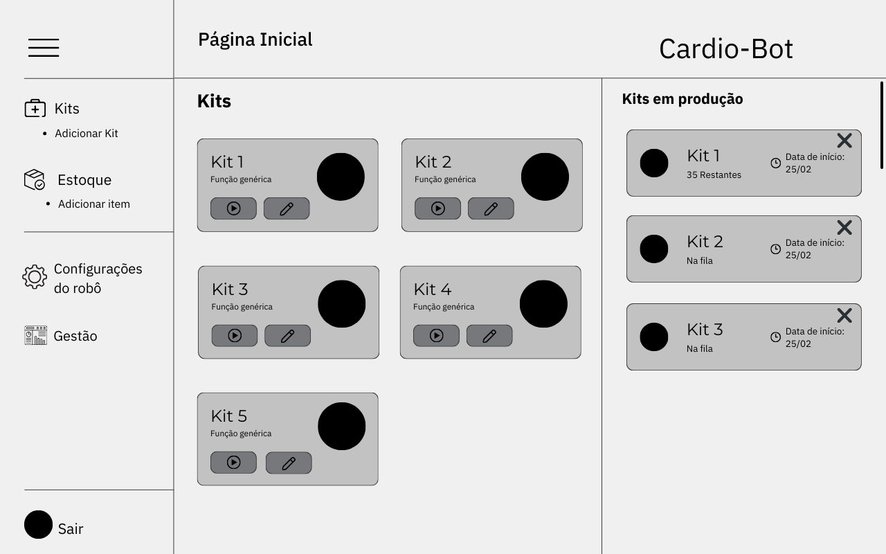

**Fonte:** Elaborado pela equipe Cardio-Bot

Como foi citado acima, na tela principal é possível visualizar kits que já foram configurados anteriormente em formato de cards, onde é possível realizar duas ações: Colocar o kit em produção ou editá-lo. 
Quando o botão de iniciar do card é pressionado, um pop-up (Tela 3) na tela aparece, com a descrição do item selecionado, a fim de ser possível conferir se tudo está certinho antes de iniciá-lo de fato. Caso o kit esteja certo, é só clicar em iniciar. 

**Tela 3** - Descrição do kit e confirmação dos dados

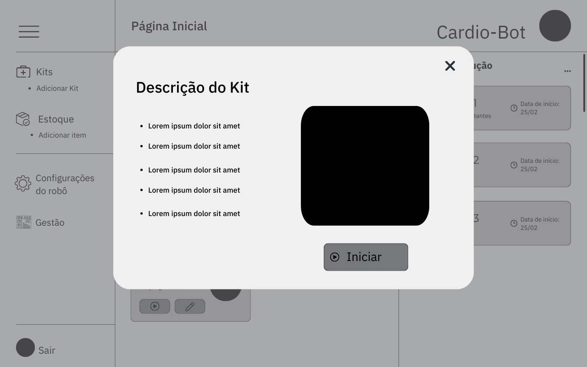

**Fonte:** Elaborado pela equipe Cardio-Bot

Caso o usuário queira realizar alguma alteração no kit, é só retornar à página principal e clicar no botão de editar o kit no card correspondente, abrindo um pop-up (Tela 4) onde é possível retirar itens da lista e buscar por outros, adicionando se necessário.

**Tela 4** - Editar Kit

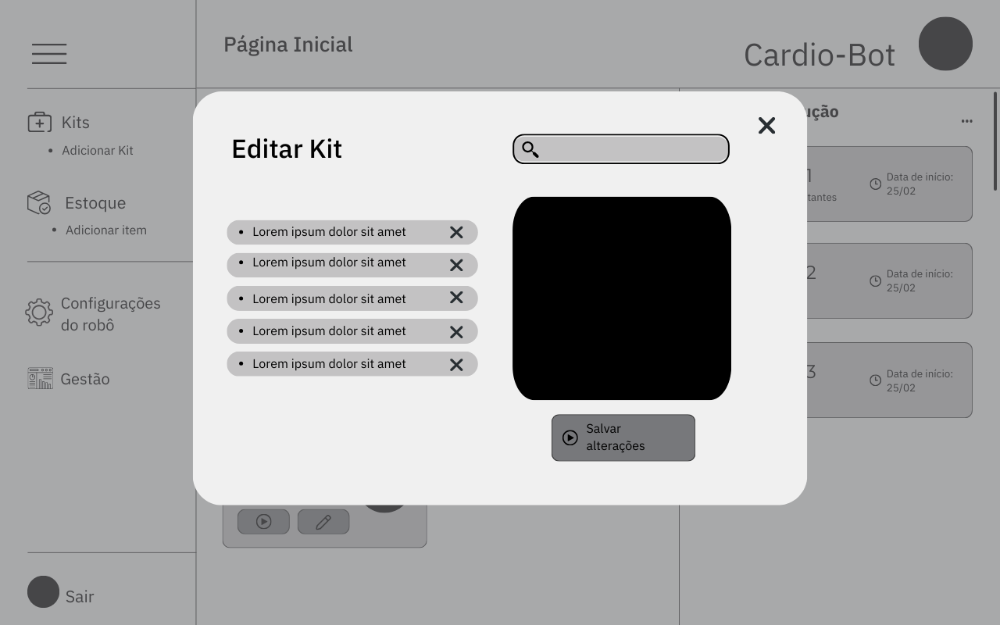

**Fonte:** Elaborado pela equipe Cardio-Bot

Como citado anteriormente, para adicionar um novo kit, é possível clicar no link "Adicionar Kit" que é visível no menu lateral, abrindo assim um pop-up (Tela 5) onde é possível adicionar um nome, descrição e os itens necessários.

**Tela 5** - Adicionar Kit

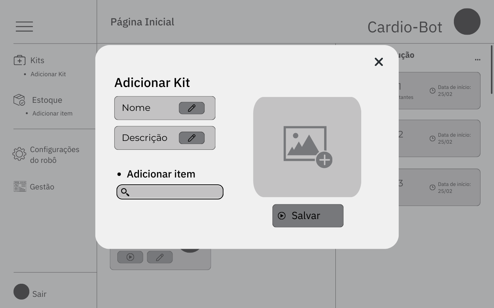

**Fonte:** Elaborado pela equipe Cardio-Bot

A página de estoque (Tela 6) é acessável pelo menu lateral também, e ela representa o pós-estoque que será feito na farmácia hospitalar. Para fins de prova de conceito, essa página inicialmente tem o layout da caixinha que será utilizada para testes.
Cada quadrado representa um espaço, que pode ser selecionado para adicionar um item. Dessa forma, ficará salvo no banco de dados que naquela posição específica sempre estará aquele item específico.

**Tela 6** - Controle de Estoque

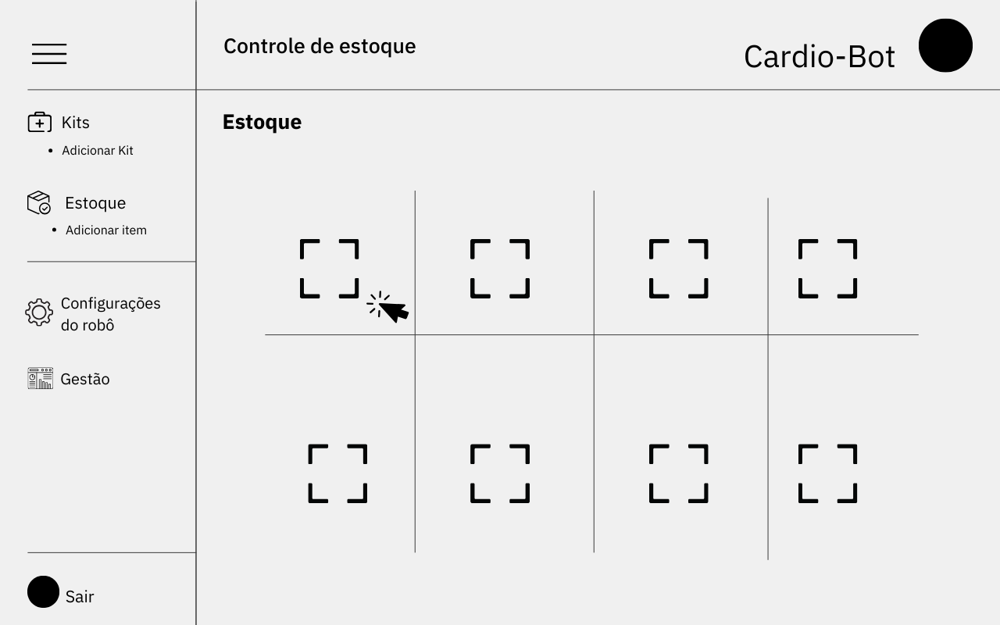

**Fonte:** Elaborado pela equipe Cardio-Bot

Por fim, ao selecionar um espaço específico, é possível editar o item correspondente, conforme a imagem a seguir (Tela 7): 

**Tela 7** - Editar componente do estoque

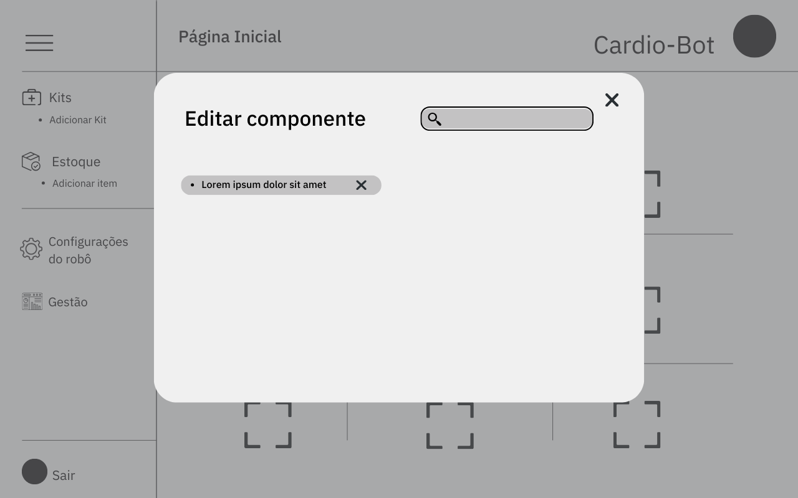

**Fonte:** Elaborado pela equipe Cardio-Bot

## Versão Mobile

Como mencionado anteriormente, a versão principal da nossa aplicação web é a desktop. Porém, para fins de flexibilidade de acesso, também foi desenvolvido um wireframe para a versão mobile, com as mesmas características e funcionalidades da versão para computador. É possível ver todas as telas correspondentes a seguir:

**Tela 1** - Login

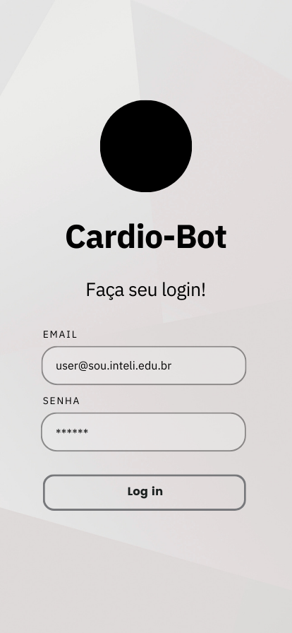

**Fonte:** Elaborado pela equipe Cardio-Bot

**Tela 2** - Página Inicial

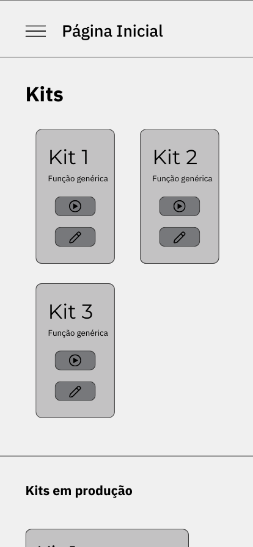

**Fonte:** Elaborado pela equipe Cardio-Bot

**Tela 3** - Continuação da Página Inicial

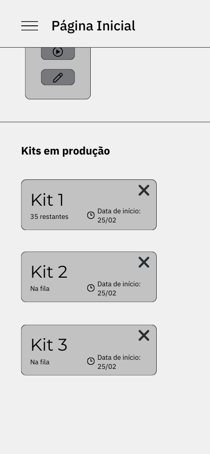

**Fonte:** Elaborado pela equipe Cardio-Bot

**Tela 4** - Menu

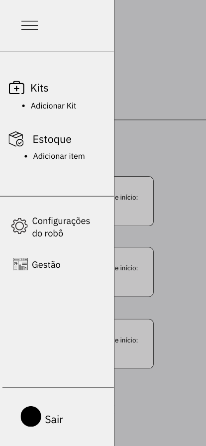

**Fonte:** Elaborado pela equipe Cardio-Bot

**Tela 5** - Descrição do Kit

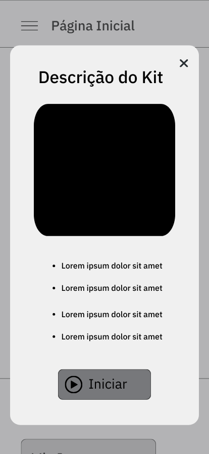

**Fonte:** Elaborado pela equipe Cardio-Bot

**Tela 6** - Editar Kit

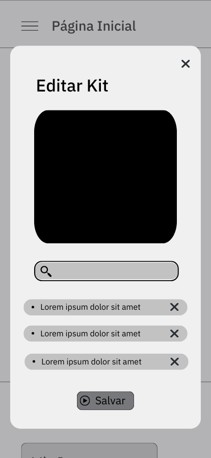

**Fonte:** Elaborado pela equipe Cardio-Bot

**Tela 7** - Adicionar Kit

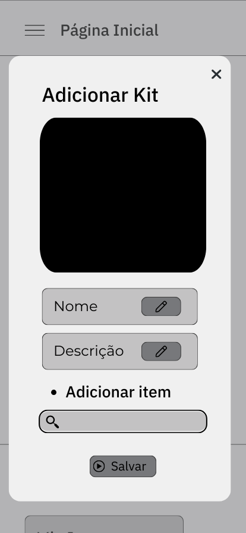

**Fonte:** Elaborado pela equipe Cardio-Bot

**Tela 8** - Controle de estoque

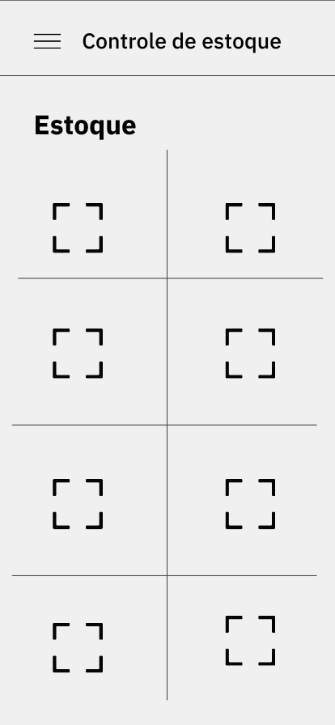

**Fonte:** Elaborado pela equipe Cardio-Bot

**Tela 9** - Editar componente do estoque

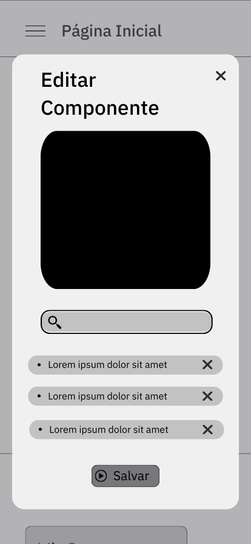

**Fonte:** Elaborado pela equipe Cardio-Bot

