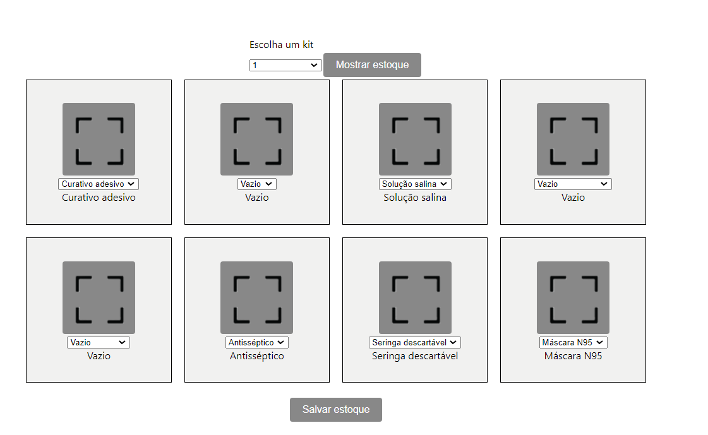
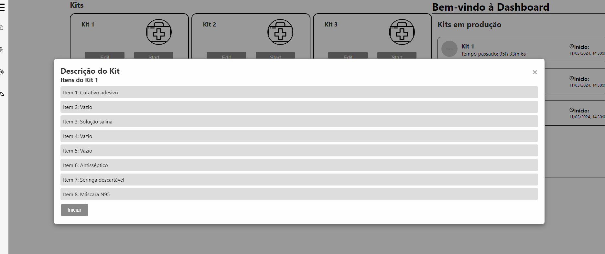

## Introdução
O objetivo principal do backend é aprimorar a interação entre o frontend e o banco de dados.

O código pode ser encontrado em : 

```
src\api\warehouse\warehouse.py
```


A escolha pelo FastAPI como framework se deu principalmente pela sua capacidade de operar de forma assíncrona, o que contribui significativamente para a eficiência e escalabilidade do sistema. Além disso, sua estrutura intuitiva e documentação abrangente tornaram-no uma opção ideal para nossas necessidades de desenvolvimento.

O objetivo central do backend é possibilitar uma experiência de interação rápida e direta para o usuário, especialmente no que diz respeito aos cinco kits disponíveis. Isso inclui garantir tempos de resposta ágeis e uma comunicação eficiente com o banco de dados.

Para armazenar e gerenciar os dados, optamos por utilizar o TinyDB, um banco de dados leve e de fácil integração com aplicações Python. O arquivo "kits.json", que contém as informações sobre os kits disponíveis, pode ser encontrado em: 

```
src\api\warehouse\kits.json
```

Essas escolhas de tecnologia e arquitetura foram feitas com o intuito de garantir um backend robusto, de alto desempenho e facilmente escalável, que atenda às demandas do projeto e proporcione uma experiência fluida ao usuário final.


## Rotas desenvolvidas
 
O objetivo das rotas desenvolvidas é realizar requisições dos tipos GET e UPDATE. Tal caminho foi escolhido com a intenção de fornecer ao usuário a capacidade de acessar informações sobre os cinco kits disponíveis e também de atualizar os componentes de cada kit por meio de modificações no banco de dados.

Essa abordagem foi desenvolvida na primeira iteração do projeto visando simplificar o funcionamento do robô e aprimorar o controle de estoque. Dessa forma, o usuário tem a opção de indicar se cada compartimento está vazio ou contém um item, facilitando a montagem dos kits pelo robô.

## Rotas em ação 

Como explicado anteriormente foram desenvolvidas as rotas de get e update. 

Nesta primeira tela o usuário tem a capacidade de atualizar cada kit individualmente. Na imagem abaixo, é evidente que o usuário pode indicar se há ou não um item em cada posição da caixa e modificar conforme sua preferência.




Já na segunda imagem, é possível observar que é feita uma requisição GET com base no kit selecionado, permitindo uma verificação dupla para garantir que os itens necessários estejam presentes na bandeja.
Assim, o operador do solução consegue ter certeza que o robô vai conseguir montar o kit em plena capacidade. 



## Conclusão 

Por fim, com a API funcional e integrada ao Frontend, o usuário pode atualizar os kits e verificar se o layout esta de acordo com a bandeja. Isso permite a montagem dos kits de forma precisa, reduzindo substancialmente o risco de erros.


