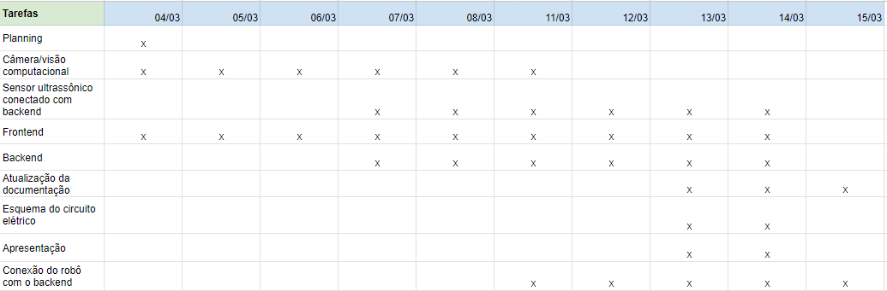

Nessa terceira sprint, começamos o desenvolvimento dos periféricos que utilizaremos no projeto (câmera e sensor ultrassônico), além de começar o desenvolvimento do front e do backend da solução, permitindo que controlemos o robô por uma interface web. Para visualização de todas as tarefas e a duração de cada uma delas, é possível observar a tabela abaixo, que lista todas as tasks e em quais dias elas foram desenvolvidas respectivamente:

****Fonte:**** Elaborado pela equipe Cardio-Bot

A seguir temos o slide de aprensetação da sprint 3:

[Clique para acessar a apresentação](../../../static/img/ApresentaçãoSprint3-Cardiobot.pdf)
