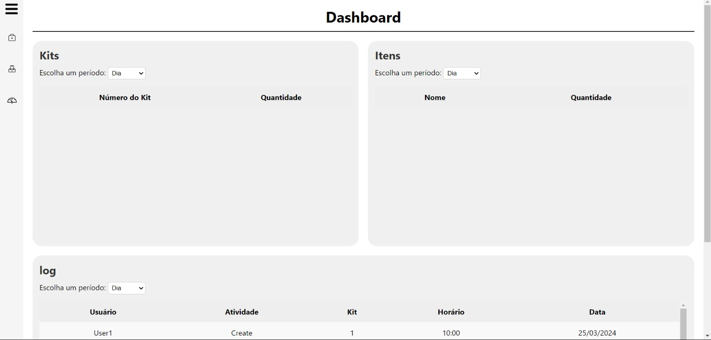

# O que foi feito?

Durante esta sprint, a tela de dashboard foi iniciada, assim como as outras telas continuaram sendo aprimoradas.

## Dashboard

Nossa dashboard de produção fornece informações vitais sobre a fabricação dos kits, incluindo o número total produzido, registros de alterações feitas nos kits e a quantidade de itens utilizados. Essa ferramenta oferece uma visão clara e instantânea do progresso da produção, permitindo uma gestão eficiente e tomada de decisões ágil para otimizar o processo produtivo.

Nessa sprint a dashbord usou de um banco de dados fictício para ser iniciada, planejamos integrá-la com nosso banco durante a quinta sprint.

Na imagem a seguir pode se ver como os dados estão dispostos na tela da Dashboard

##Pop-up adicionado 

Mais um incremento dessa Sprint foi a adição de um pop-up ao clicar em iniciar um kit, ná página inicial. Dentro desse pop-up, pode-se confirmar os itens presentes dentro do kit selecionado, como é possível visualizar na foto abaixo:

 

**Imagem 2: Confirmar Kit**

**Fonte:** Elaborado pela equipe Cardio-Bot 

