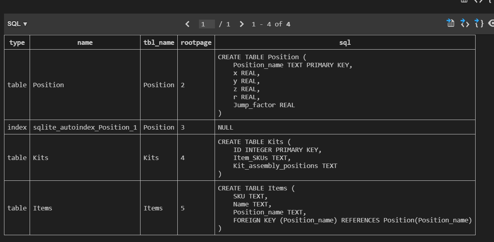
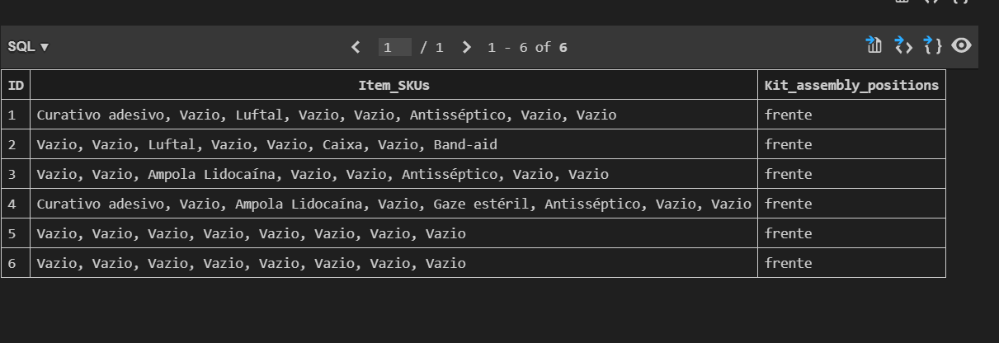

## Introdução
O objetivo principal do backend é aprimorar a interação entre o frontend e o banco de dados.
A solução para funcionar de forma correta necessita rodar diferentes backends e os avanços em relação aos mesmos serão descritos na seção abaixo.


### Backend Warehouse

Esse backend tem como objetivo permitir a conexão da tela <code>/supplies</code> com o banco de dados. 

Em relação aos avanços desta sprint, o principal foi a mudança do banco de dados TinyDB para um banco de dados SQL relacional, o SQLite3. Tendo em mente o funcionamento do projeto, é primordial que os dados sigam uma estrutura consistente, e o SQLite transmite essa capacidade.

A maneira como a solução foi concebida é que, a partir da montagem dos kits, o robô já deve saber para onde ir. Assim, os dados são enviados com um padrão uniforme, facilitando a lógica desenvolvida na API do robô.

O banco de dados criado pode ser acessado em 

```
src\backend\database\dbCardioBot.db
```

Na imagem abaixo é possível conferir todas tabelas que foram desenvolvidas  :




Já nesta imagem é possível conferir como os dados estão sendo salvos na tabela de Kits. 



### Backend Dashboard

Esse backend tem como objetivo permitir a conexão da tela <code>/dashboard</code> com o banco de dados.

A pasta dashboard foi criada completamente nessa sprint e ela é composta por dois códigos: um que cria um banco de dados em TinyDB para ser usado e o outro que é o backend em si. 

O banco de dados é em TinyDB porque ele é gerado pela API do robo. Sendo assim, toda a comunicação de banco de dados feita pelo robô é feita por TinyDB. Esse banco de dados é composto por duas tabelas, uma de kits e outra de itens. A tabela de itens tem duas colunas: ID e nome. A tabela de kits possui ID, numero_do_kit, itens, date_created. Os itens representados dentro do kit significa a quantidade de cada item em um kit. Então, se um número de item se repete, a quantidade de vezes que repetir será a quantidade de determinado item no kit.

O backend liga o banco de dados ao frontend mandando as informações contidas no TinyDB, podendo ser filtrado por dia, semana, mês e ano. Note que o calculo dos períodos de tempo é feito por dia absoluto, sendo o dia contado como o dia atual do calendário, a semana é o período de hoje até sete dias atrás, mês, até 30 dias atrás e ano, até 365 dias atrás.