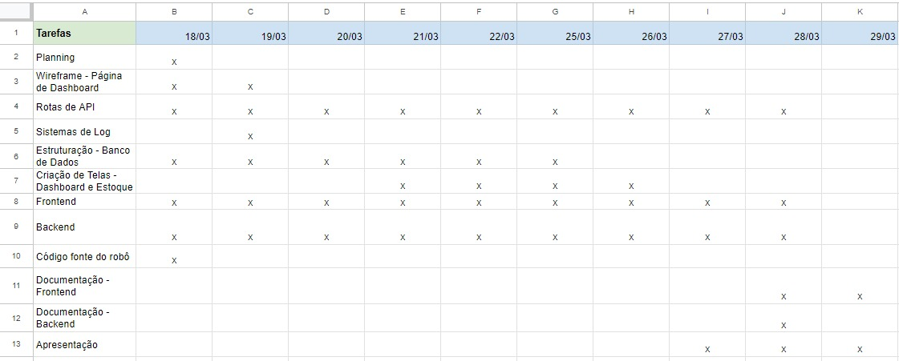

Nessa quarta sprint, começamos a integração de todas as partes que compõem a solução -backend, frontend, raspberry pi pico, robô, câmera- além de adicionar a nova tela de dashboard. Para visualização de todas as tarefas e a duração de cada uma delas, é possível observar a tabela abaixo, que lista todas as tasks e em quais dias elas foram desenvolvidas respectivamente:

****Fonte:**** Elaborado pela equipe Cardio-Bot

A seguir temos o slide de aprensetação da sprint 4:

[Clique para acessar a apresentação](../../../static/img/ApresentacaoSprint4.pdf)