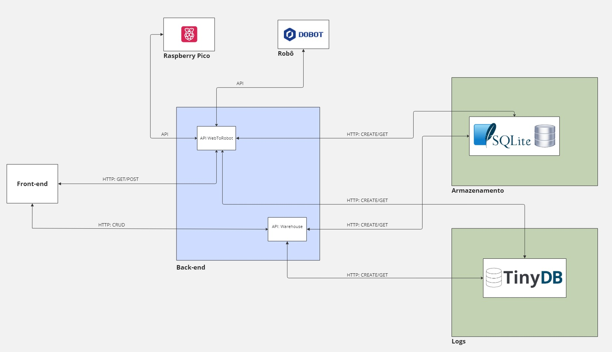

# O que foi feito?

Na última sprint desenvolvemos todo um mapa da arquitetura da solução.

## Arquitetura

Na figura abaixo é possível observar em detalhes a arquitetura da solução desenvolvida ao longo das últimas 10 semanas.
Pensando em desenvolver uma solução que consiga atender todas as demandas do usuário seja de um frontend interativo, backend funcional, api que conecta com o robô e um sistema de logs robusto. 
Toda a arquitetura da solução foi pensada em como tornar esse fluxo de informações direto e evitar o desenvolvimento de uma solução monolítica. 

Na figura abaixo é possível acompanhar em detalhes cada parte da arquitetura. 

## Funcionamento da arquitetura 

A arquitetura da solução foi desenvolvida para facilitar a compreensão tanto do desenvolvedor quanto do usuário interessados em entender melhor como o projeto foi desenvolvido. Para isso, cada bloco representa uma parte única do projeto, sobre a qual serão discutidos seus respectivos funcionamentos.

#### Front-end 

O frontend é por onde os usuários interagem com toda a solução. No frontend o usuário pode interagir com duas API's distintas do backend. 

Na API **WebToRobot** é possível fazer requisições do tipo POST/GET e interagir com o robô. 
Já na API **Warehouse** é possível interagir com o CRUD para definir os kits de medicamentos que estarão disponíveis para o robô montar.

Assim, no frontend, o usuário tem a possibilidade de comunicar como os kits serão compostos e executar a montagem de tais kits com o robô sem problema algum. 

#### Back-end 

O backend é o coração da solução, é nesta etapa que ocorre a implementação de todas as regras de negócio e partes distintas são capazes de se comunicar. 
Pensando em desenvolver uma solução mais robusta e modularizada foram desenvolvidas duas API's que possuem objetivos bem distintos e que garantem um funcionamento mais direto, rápido e seguro para o projeto. 

**API Warehouse :** A função principal desta API é receber os inputs do usuário sobre como ele deseja que os kits sejam montados. A partir disso, os kits são salvos e enviados para o banco de dados. Com os dados salvos, a API WebToRobot consegue acessá-los e montar os kits definidos pelo usuário. Além disso, nesta API, também é realizada a leitura dos dados de log no dashboard. 

**API WebToRobot :** O objetivo desta API é garantir a comunicação com o robô MagicianLite. Foram desenvolvidas rotas para interagir com o robô, utilizar a câmera e obter informações do sensor ultrasônico. Esta API permite que o robô saiba onde deve ir para pegar medicamentos e montar determinado kit. Além disso, a API também permite que o robô interaja e se comunique com outros tipos de sensores. Essas funções aumentam a confiabilidade da solução e permitem atender todas as demandas prometidas ao longo das sprints.

#### Armazenamento 

O sistema de armazenamento foi desenvolvido o banco de dados relacional SQLITE3. O objetivo de usar um banco relacional é a maior facilidade para interagir entre as tabelas e o fato de que muitas lógicas desenvolvidas na API WebToRobot dependem de um sistema que mantem os dados da maneira correta. Assim, o banco de dados consegue facilitar tais interações. 
Um exemplo desse funcionamento é o sistema de kits. O usuário define se há ou não um item em determinada posição e sua quantidade utilizando API Warehouse. A partir desse input, a API WebToRobot é acionada para montar determinado kit e com base nos dados de composição do kit há a definição se vai ou não para um mapa de posições previamente definidas em uma tabela distinta.

#### Logs 

O sistema de logs é uma forma de rastreabilidade para entender melhor como os usuários interagem com a solução, quais são as funções mais utilizadas, produtividade do robô e até mesmo guardar possíveis bugs ou crashs na aplicação. 

A rota de logs só funciona com métodos post ou get. Os logs são salvos automaticamente com cada interação com as API's que foram descritas previamente. Assim, alterações nos kits, inicio e fim das operações do robô, erros de montagem e checagem de peças geram logs automáticos. Tais logs alguns estão disponíveis na tela de Dashboard e podem ser acompanhados pelo usuário final. 

#### Raspberry Pico 

O Raspberry Pico é utilizado como o microcontrolador do sensor ultra sonico, este sensor tem o objetivo de checar e avisar se o robô conseguiu ou não pegar determinado objeto. O mesmo, se conecta atráves da API WebToRobot e é importantissímo para adicionar um sistema de dupla checagem e confiança na solução. 

#### Robô 

O robô é o protagonista do projeto, ele é o responsável por atuar conforme o usuário definiu anteriormente. O robô se comunica utilizando a API WebToRobot e realiza todo o processo de montagem dos kits. 

## Conclusão 

A arquitetura da solução é uma forma de enxergar o projeto de um nível acima do código e entender como cada parte se comunica. Para entender mais sobre cada parte individual é recomendado que o leitor acompanhe as secções respectivas de cada bloco do diagrama. 