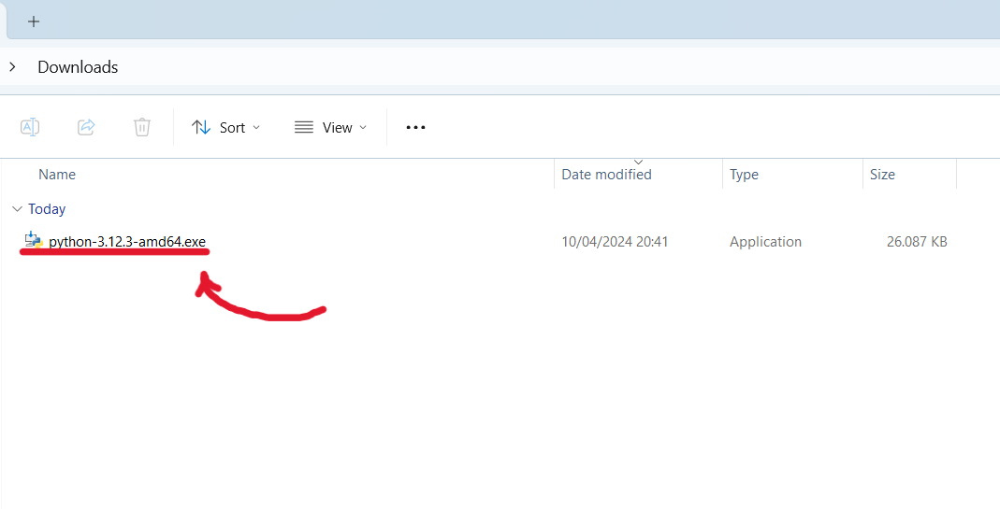
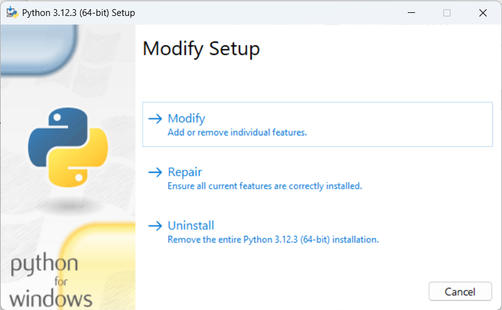
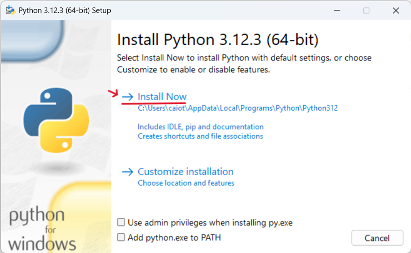
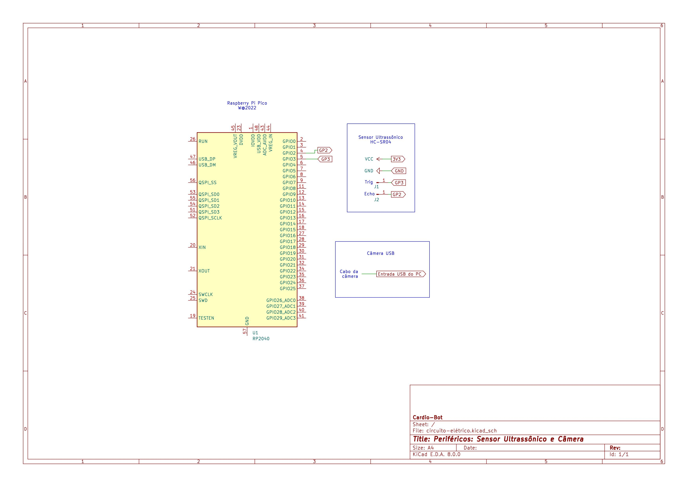
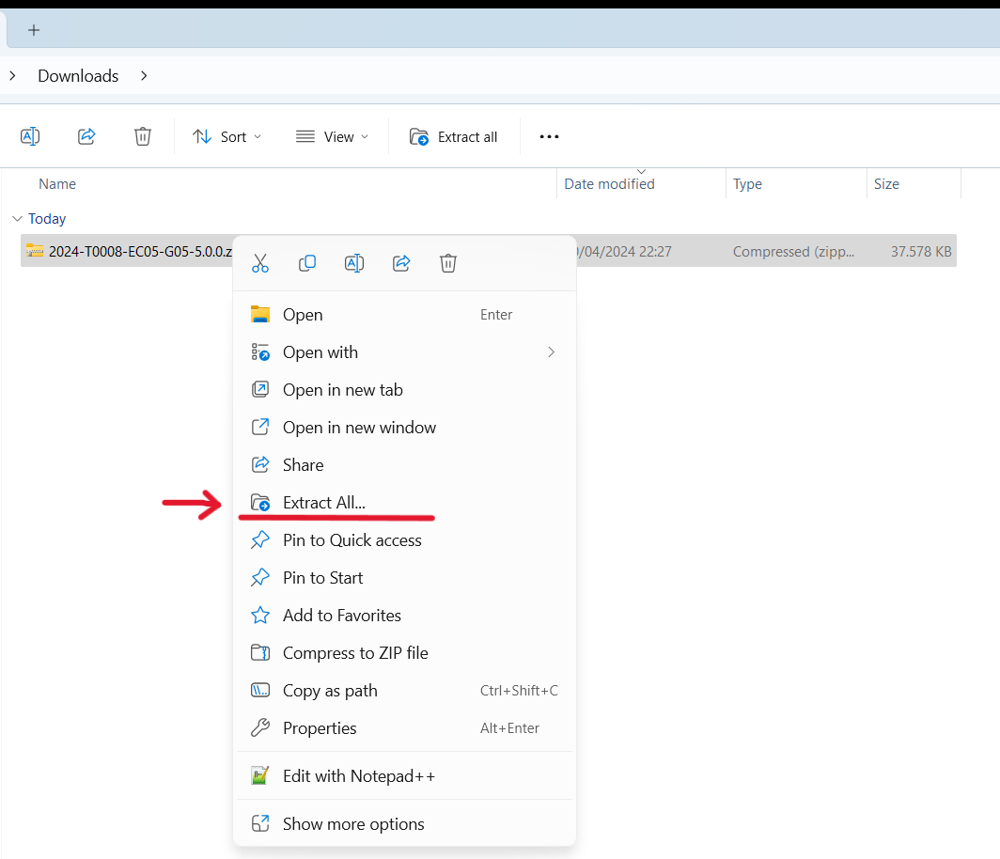
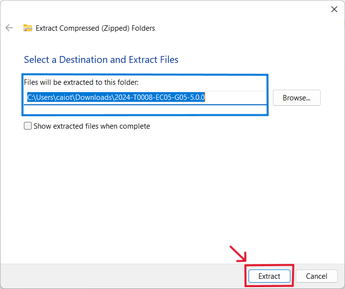
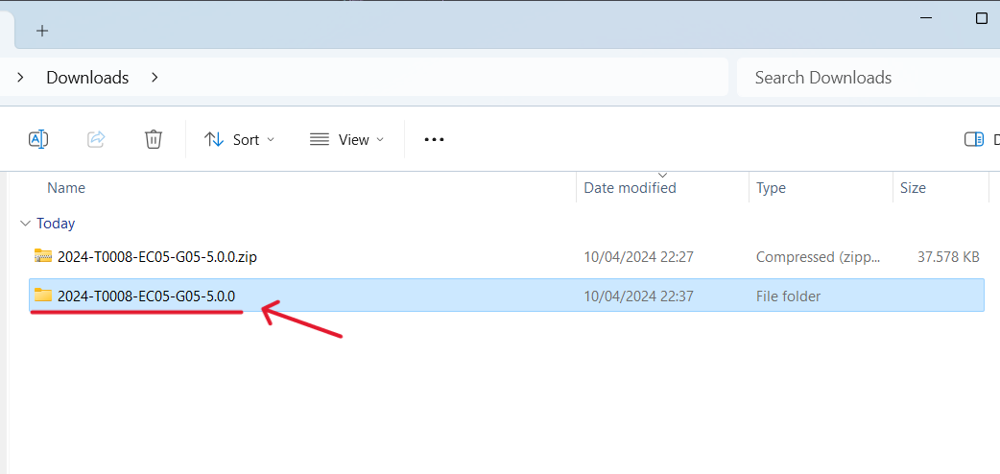
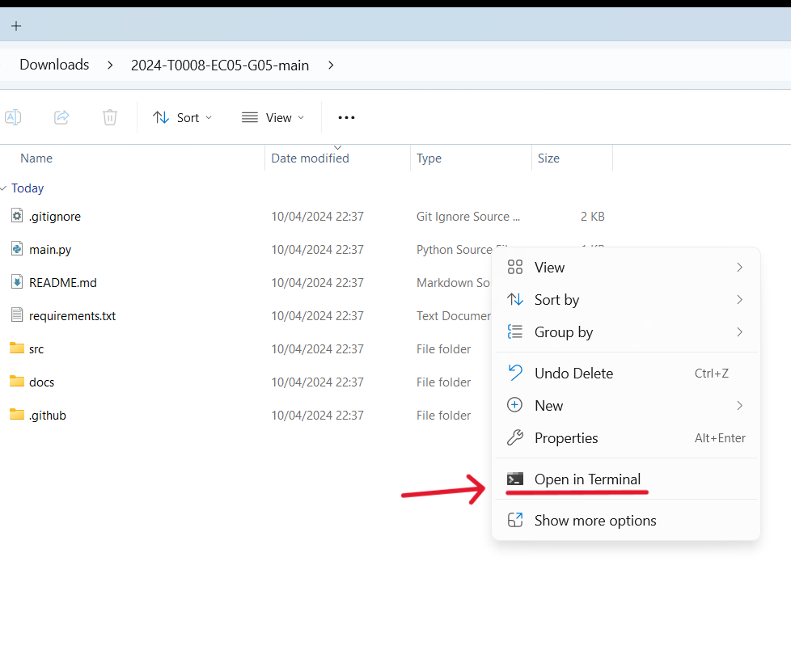

Durante esta sprint

# Mudanças:
Durante essa Sprint algumas mudanças foram feitas no processo de execução do projeto, tanto para Linux/MacOS, quanto para Windws.

## Requisições:
Tendo em mente que o projeto roda em cima da linguagem Python, é preciso que o computador a tenha instalada, na sua versao 3.12.3 .

Os systemas operacionais suportados nesse projeto são:
- Windows 10/11

## Intalações de arquivos

### Python
Caso o computador ainda não possuia Python, acesse aqui: **[Instladaor Python](https://www.python.org/ftp/python/3.12.3/python-3.12.3-amd64.exe)**.

Em seguida, acesse o gerenciador de arquivos, na pasta de Downloads, e execute o arquivo.

<div align="center">

**Figura 1:** Arquivo executor



**Fonte:** Elaborado pela equipe Cardio Bot
</div>

Se o computador já possuir a linguágem python instalada, aparecerá a janela a baixo.

Nesse caso, vá direto para o tópico de [Execução do projeto](#execução-do-projeto)

<div align="center">

**Figura 2:** Tela -  Pytho já instalado



**Fonte:** Elaborado pela equipe Cardio Bot

</div> 


Se esse não for o caso, a seguinte janela irá aparecer, clique na área `Install Now`, se o sistema estiver em inglês, `Intale Agora`, para o sistema em português.

<div align="center">

**Figura 3:** Tela - Intalando Python



**Fonte:** Elaborado pela equipe Cardio Bot

</div> 

Acessando o seguinte link, será feito o download do zip do projeto: [2024-T0008-EC05-G05-5.0.0](https://github.com/Inteli-College/2024-T0008-EC05-G05/archive/refs/tags/v4.0.0.zip)

Agora abra o gerenciador de arquivos para, e extraia a pasta, para fazer isso, clique com o potão direito do mouse em cima do nome da pasta e aperte em extrair tudo:

## Raspberry Pico (Sensor de Distância)
Para utilizar o sensor de distância, siga os passos abaixo:

**Primeiro Passo: Montar o circuito do Raspberry Pico**

A seguir é apresentado o esquema elétrico do circuito do Raspberry Pico:

<div align="center"> 

**Figura 4 - Esquema elétrico dos periféricos** 



**Fonte:** Elaborado pela equipe Cardio-Bot 

</div>

**Segundo Passo: Instalar o firmware no Raspberry Pico**

Para instalar o firmware no Raspberry Pico, siga os passos abaixo:

1. Instale o [Thonny IDE](https://thonny.org/).
2. Faça o setup inicial do Raspberry Pico, seguindo o [tutorial oficial](https://projects.raspberrypi.org/en/projects/getting-started-with-the-pico).
3. Instale o [MicroPython](https://micropython.org/download/rp2-pico/).
4. Abra o Thonny IDE e conecte o Raspberry Pico ao computador.
5. Vá até a pasta `src/CodigoRasp/UltraSonico.py` e copie o código.
6. Cole o código no Thonny IDE, em um arquivo chamdado `main.py` e substitua os valores de `SSID` e `PASSWORD` pelas credenciais da sua rede Wi-Fi e o valor de `ip_servidor` pelo IPV4 do seu computador.
7. Clqiue em `Run` para executar o código.

Nos estamos utilizando o MicroPython para programar o Raspberry Pico.

Após seguir todos os passos, o sensor de distância estará pronto para ser utilizado e pode ser ligado utilizando alguma fonte de energia, como um power bank.


:::danger

IMPORTANTE - Para que a solução funcione corretamente, é necessário que o Raspberry Pico esteja ligado e o sensor de distância esteja conectado ao Raspberry Pico. Além disso, é necessário que o robô esteja ligado e conectado ao computador.

:::

Após seguir todos os passos, a solução estará pronta para ser utilizada.

<div align="center">
**Figura 5:** Tela - Selecionar extração de arquivos



**Fonte:** Elaborado pela equipe Cardio Bot

</div> 

Ao realizar essa etapa, aparecerá a tela de extração dos arquivos. Nela será preciso escolher a pasta de destino da extração e inicialinar a extração.

Para selecionar a pasta de destino, basta colocar a rota da pasta na barra superior, marcada de azul.

Já para executar, aperter `Enter` ou aperter em `Extrair`, marcado de vermelho.

<div align="center">

**Figura 6:** Tela - Extraindo arquivos



**Fonte:** Elaborado pela equipe Cardio Bot

</div> 


Pronto, todos os arquivos foram instalados, agora será mostrada a execução do projeto.


#### Execução do projeto

Após isso, vá até o arquivo `src/frontend/src/components/kit_description_popup/KitDescriptionPopup.js` e substitua o valor de `ip_servidor` pelo IPV4 do seu computador. Isso vai fazer com que o frontend consiga se comunicar com o backend do robô e com o Raspberry Pico.

Em seguida, acesse a pasta que que foi feita a extração dos arquivos e nela clique com o botão direito do mouse e abra um terminal.

<div align="center">

**Figura 7:** Tela - Acessando pasta do projeto



**Fonte:** Elaborado pela equipe Cardio Bot

</div> 

<div align="center">

**Figura 8:** Tela - Iniciando DMC



**Fonte:** Elaborado pela equipe Cardio Bot

</div> 


Dentro do CMD, digite o comando abaixo e aperte `Enter`. Isso fará que mais 3 CMDs apareçam. 

- O primeiro CMD executa o front-end;
- O segundo CMD executa a API do braço robótico;
- O terceiro CMD executa a API de estoque e logs do sistema;

```bash
python main.py
```
