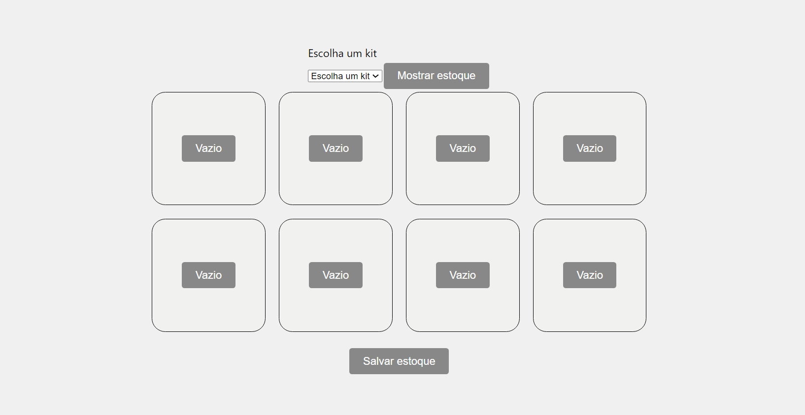

## Introdução

Nessa secção é possível conferir a versão final do projeto e acompanhar as mudanças e fluxos de tela no frontend. 

## Telas desenvolvidas 

Com o objetivo de garantir uma experiência fluida para o usuário, que permita a edição de akits, o acompanhamento de informações sobre esses kits, a inicialização do robô e o acompanhamento dos logs das operações. Pensando em atender este fluxo foram desenvolvidas 4 telas principais. 

#### Login
Ao iniciar o projeto, o usuário é direcionado para a tela de login, onde pode acessar o sistema. O padrão de login e senha é:

**Login**: admin

**Senha**: admin

A figura abaixo ilustra a aparência da tela de login: 

#### Navegação 

Em todas as páginas do frontend, os usuários podem acessar o menu hamburguer localizado no canto superior esquerdo. Este menu oferece acesso rápido a outras páginas do sistema, permitindo uma navegação fluida e intuitiva.

Na figura abaixo é possível acompanhar o menu que foi desenvolvido. 

#### Home 
Após o usuário realizar o login com sucesso, ele é direcionado para a página inicial. Nesta página, é possível acompanhar cada kit individualmente, juntamente com uma barra de status que indica o progresso da montagem de cada kit.

Na figura abaixo é possível ver como a tela foi desenvolvida. 

Nesta tela, o usuário pode enviar comandos para o robô iniciar a montagem de um kit específico. Isso é feito ao clicar no botão "Start" associado a cada kit individual. Após clicar no botão correspondente ao kit desejado para montagem, o usuário pode verificar os itens que o compõem, conforme mostrado na imagem abaixo:

Após revisar todos os itens do kit e garantir que tudo está correto, basta clicar no botão "Iniciar" para que o robô comece a montagem deste kit específico.

#### Supplies 

A tela de suprimentos permite ao usuário da solução definir os itens e suas quantidades que compõem cada kit específico. O objetivo desta tela é permitir a personalização cada kit produzido para atender às demandas do hospital Sírio-Libanês.

Na figura abaixo é possível ver como é primeira vez utilizando a tela. 

Nesta tela ao clicar no menu e escolher um kit é possível editar o mesmo igual na imagem abaixo. 

Assim, ao voltar para a tela Home e selecionar o kit número 4 as mudanças já estarão salvas e o robô vai montar esse novo padrão de kit.

#### Dashboard

A tela de Dashboard é o local onde é possível acessar todos os logs do sistema. Nesta tela, existem três áreas distintas que fornecem logs de diferentes partes do projeto.

Na figura abaixo, há os componentes que representam os logs dos kits produzidos e os itens utilizados:

Na próxima figura, estão os logs das ações que o robô realizou.

Além disso, é possível organizar os logs de acordo com o botão de período. Assim há uma granularidade maior nos dados, permitindo que o usuário encontre as informações que deseja de forma mais fácil. 

## Conclusão

Durante o desenvolvimento do frontend, o grupo optou por adotar um estilo mais minimalista, evitando o uso excessivo de cores. O objetivo foi proporcionar uma jornada de usuário direta e intuitiva para os usuários do site. Dessa forma, é possível interagir com os kits, o robô e acompanhar os logs de forma clara e objetiva. Além disso, os padrões de desenvolvimento foram feitos respeitando as heurísticas de Nielsen.